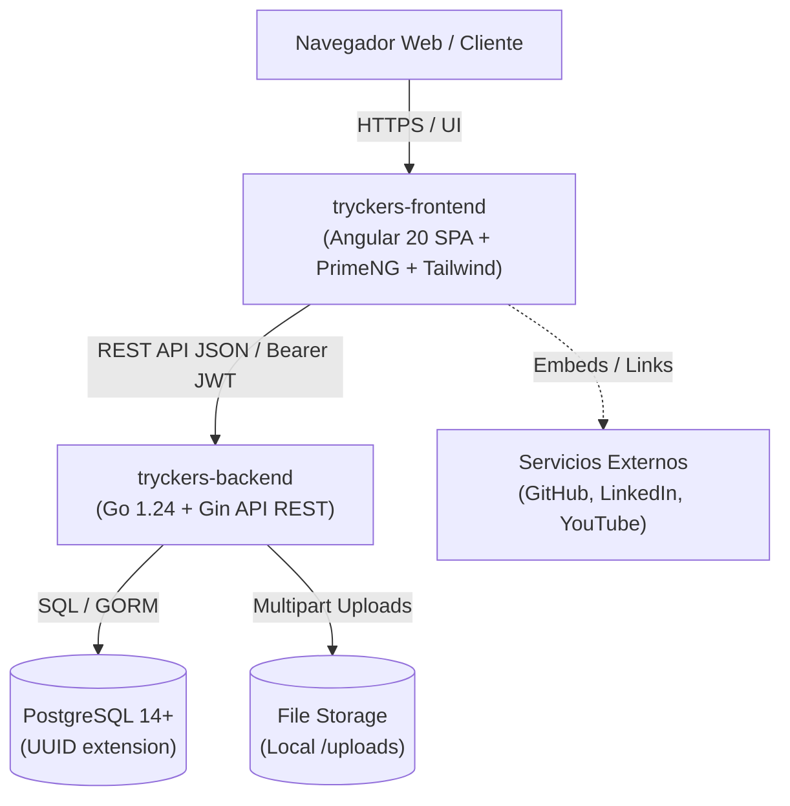

> Idioma del proyecto: **español**. Escribe este conocimiento en español. Mantén en inglés el código, los nombres de archivo, los comandos y las claves de configuración.

# tryckers — System Context

## System Purpose

Tryckers es una plataforma y red profesional técnica diseñada para la comunidad de desarrolladores de software en Latinoamérica. El sistema permite construir identidad profesional respaldada por código y proyectos reales, publicar y debatir artículos técnicos, votar contenido de la comunidad y conectar con oportunidades laborales y reclutadores.

## System Components

### Component Breakdown
1. **`tryckers-frontend` (SPA):** Interfaz de usuario reactiva para autenticación, gestión de perfil, explorador de directorio de miembros, editor de publicaciones, cartelera semanal y comentarios.
2. **`tryckers-backend` (Core API):** Servidor HTTP en Go que expone endpoints REST versionados (`/api/v1`), maneja la lógica de dominio, valida DTOs, aplica reglas de autorización y gestiona transacciones en la base de datos.
3. **`PostgreSQL Database`:** Motor relacional para persistencia de usuarios, credenciales hasheadas, perfiles, publicaciones, votos y comentarios.
4. **`File Storage System`:** Servicio de almacenamiento de imágenes (avatars y banners) en el disco local (`/uploads`).

## Integration Model

- **Protocolo de Comunicación:** HTTP/REST con payloads serializados en JSON.
- **Autenticación en Tránsito:** Cabecera estándar `Authorization: Bearer <JWT>` en peticiones protegidas.
- **Subida de Archivos:** Requests `multipart/form-data` para subida de medios.
- **Cross-Origin Resource Sharing (CORS):** Control centralizado en middleware de Gin para validar el origen del cliente web (`FRONTEND_URL`).

## Deployment Topology

- **Entorno de Desarrollo:**
  - Backend: Servidor local en puerto `:8080` conectado a PostgreSQL local o contenedor Docker.
  - Frontend: Servidor de desarrollo Angular (`ng serve`) en puerto `:4200`.
- **Topología de Producción Planificada:**
  - Frontend desplegado como archivos estáticos optimizados en CDN / Cloudflare Pages / Vercel.
  - Backend desplegado en contenedor Docker (AWS ECS / Fly.io / GCP Cloud Run).
  - Base de datos gestionada PostgreSQL (AWS RDS / Supabase / Neon).
  - Almacenamiento multimedia migrado a bucket compatible con S3 (Cloudflare R2 / AWS S3).

## Cross-Cutting Concerns

- **Autenticación y Autorización:** Tokens JWT de corta duración, refresh tokens, middleware de validación de firma y control de acceso basado en roles (`Admin`, `Member`, `Recruiter`).
- **Seguridad de Datos:** Contraseñas hasheadas con bcrypt, no exposición de campos sensibles en serializadores JSON (`json:"-"`).
- **Manejo de Errores:** Respuestas de error estandarizadas con códigos HTTP semánticos y mensajes descriptivos en español.
- **Documentación de API:** Especificación viva OpenAPI / Swagger accesible en `/swagger/index.html`.

────────────────────────
Agent: architecture-agent

Produced:
knowledge/tech/system/system-context.md

Next:
decision-agent
roadmap-agent
────────────────────────
